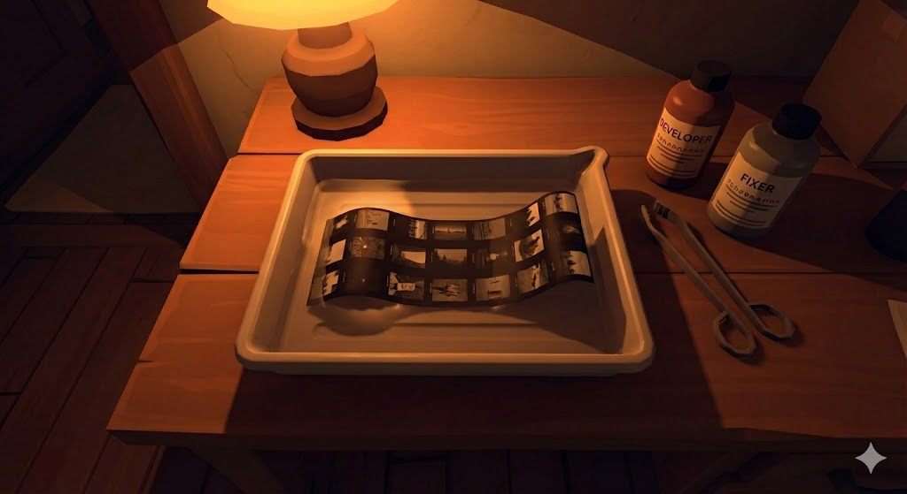

# Blender Assets

This folder contains Blender source files and Python scripts for generating the Firewatch-style darkroom scene.

## Reference

## Quick Start

1. Open Blender (3.6+ recommended)
2. Go to **Scripting** workspace
3. Open `generate_darkroom.py`
4. Click **Run Script**
5. The complete scene will be generated

## Files

| File | Description |
|------|-------------|
| `generate_darkroom.py` | Main scene generator script |
| `materials.py` | Stylized material definitions |
| `export_glb.py` | GLB export with optimized settings |

## Scene Components

Based on the Firewatch reference:

- **Table Lamp** - Frosted ceramic/glass globe with warm glow
- **Development Tray** - Shallow plastic tray with beveled edges
- **Contact Sheet** - Flat plane for clear photo viewing
- **Chemical Bottles** - Developer & Fixer bottles with labels
- **Scissors/Tongs** - Metal tools beside tray
- **Wooden Table** - Warm wood grain surface

## Lighting Setup

The scene uses **overhead lighting** from the table lamp position:
- Point light inside lamp globe
- Warm orange color: `#ff5e00`
- Soft shadows for stylized look
- Ambient occlusion baked into textures

## Export Settings

When exporting to GLB:
- Enable Draco compression
- Embed textures
- Apply modifiers
- Export vertex colors (for baked lighting)
