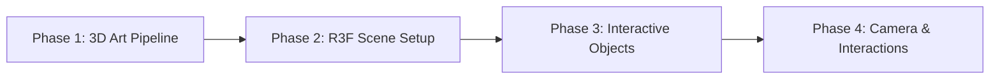

# Year in Review: Firewatch Darkroom

A 3D interactive year in review website styled as a Firewatch-inspired darkroom where photos appear as developing contact sheets.

## The "Firewatch" Darkroom Aesthetic

| Element | Description |
|---------|-------------|
| **Geometry** | Low-poly models with distinct edges. Objects have a chunky, tactile feel |
| **Textures** | Stylized, painterly textures with visible brush strokes |
| **Lighting** | Thick volumetric fog, dramatic warm coppery lights, high contrast |
| **Color Palette** | Deep oranges, burnt reds, sepia tones, shadow purples |

## Tech Stack

| Layer | Technology |
|-------|------------|
| **Core Framework** | React |
| **3D Engine** | React-Three-Fiber (R3F) + Three.js |
| **3D Modeling** | Blender |
| **Post-Processing** | @react-three/postprocessing |
| **Camera Animation** | Theater.js or GSAP |

## Development Phases



| Phase | Focus | Deliverable |
|-------|-------|-------------|
| [Phase 1](01-Phase1-3DArtPipeline.md) | Blender modeling & texturing | `.glb` scene file |
| [Phase 2](02-Phase2-R3FSceneSetup.md) | Atmosphere & post-processing | Lit 3D scene in browser |
| [Phase 3](03-Phase3-InteractiveObjects.md) | Liquid shaders & contact sheets | Interactive trays |
| [Phase 4](04-Phase4-CameraChoreography.md) | Camera moves & UX flow | Complete experience |

## UX Flow Summary

1. **Start** → Pitch black screen, audio prompts only
2. **Click** → Safe light flares on, fog illuminates room, camera tilts to sink
3. **View** → Standing at sink perspective, wet trays, contact sheet submerged
4. **Navigate** → Swipe moves viewpoint along sink to different trays
5. **Inspect** → Click photo to dolly in, fill vision with photo detail

## Project Structure

```
Year in review/
├── docs/                    # Phase documentation
├── blender/                 # Blender source files
│   ├── darkroom.blend       # Main environment
│   └── exports/             # GLB exports
├── public/
│   └── models/              # Production 3D assets
├── src/
│   ├── components/          # React components
│   │   ├── Scene.jsx        # Main R3F scene
│   │   ├── Darkroom.jsx     # Environment loader
│   │   ├── Tray.jsx         # Liquid tray component
│   │   └── ContactSheet.jsx # Photo sheet component
│   ├── shaders/             # Custom GLSL shaders
│   ├── hooks/               # Custom React hooks
│   └── App.jsx
└── package.json
```
