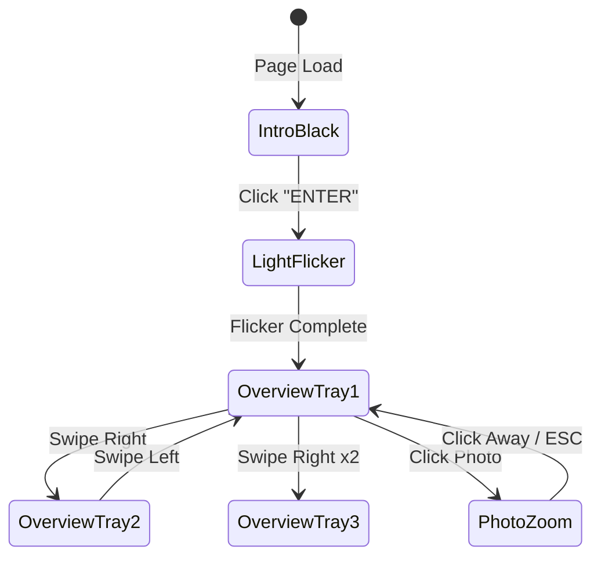

# Phase 4: Camera Choreography & Interactions

> **Goal**: Orchestrate cinematic camera movements and create the complete UX flow from darkroom entry to photo inspection.

## Prerequisites

- [ ] Phase 3 complete: Interactive trays and sheets functional
- [ ] Theater.js or GSAP installed
- [ ] State management wired up

## 4.1 Overview: We're Moving a Camera, Not Scrolling

This is a fundamental shift from traditional web design. Users don't scroll—they navigate through 3D space. Every user action triggers a camera movement.



## 4.2 Camera Rig Setup

### Camera Controller Component

```jsx
// src/components/CameraController.jsx
import { useRef, useEffect } from 'react'
import { useThree, useFrame } from '@react-three/fiber'
import { PerspectiveCamera } from '@react-three/drei'
import * as THREE from 'three'
import gsap from 'gsap'
import useStore from '../hooks/useStore'

// Predefined camera positions
const CAMERA_POSITIONS = {
  intro: {
    position: [0, 2.5, 0.5],
    lookAt: [0, 2.8, 0],    // Looking up at light
    fov: 50
  },
  overview: {
    position: [0, 1.6, 1.5],
    lookAt: [0, 0.8, 0],     // Looking at trays
    fov: 50
  },
  tray0: {
    position: [-0.8, 1.4, 1.2],
    lookAt: [-0.8, 0.7, 0],
    fov: 45
  },
  tray1: {
    position: [0, 1.4, 1.2],
    lookAt: [0, 0.7, 0],
    fov: 45
  },
  tray2: {
    position: [0.8, 1.4, 1.2],
    lookAt: [0.8, 0.7, 0],
    fov: 45
  }
}

export default function CameraController() {
  const cameraRef = useRef()
  const targetRef = useRef(new THREE.Vector3())
  
  const cameraTarget = useStore(state => state.cameraTarget)
  const currentTray = useStore(state => state.currentTray)
  const currentPhotoPosition = useStore(state => state.currentPhotoPosition)
  
  // Handle camera transitions
  useEffect(() => {
    if (!cameraRef.current) return
    
    let targetConfig
    
    if (cameraTarget === 'photo' && currentPhotoPosition) {
      // Zoom to specific photo
      targetConfig = {
        position: [
          currentPhotoPosition.x,
          currentPhotoPosition.y + 0.3,
          currentPhotoPosition.z + 0.4
        ],
        lookAt: [
          currentPhotoPosition.x,
          currentPhotoPosition.y,
          currentPhotoPosition.z
        ],
        fov: 25
      }
    } else if (cameraTarget === 'intro') {
      targetConfig = CAMERA_POSITIONS.intro
    } else {
      targetConfig = CAMERA_POSITIONS[`tray${currentTray}`] || CAMERA_POSITIONS.overview
    }
    
    // Animate camera position
    gsap.to(cameraRef.current.position, {
      x: targetConfig.position[0],
      y: targetConfig.position[1],
      z: targetConfig.position[2],
      duration: 1.5,
      ease: 'power2.inOut'
    })
    
    // Animate look target
    gsap.to(targetRef.current, {
      x: targetConfig.lookAt[0],
      y: targetConfig.lookAt[1],
      z: targetConfig.lookAt[2],
      duration: 1.5,
      ease: 'power2.inOut'
    })
    
    // Animate FOV for zoom effect
    gsap.to(cameraRef.current, {
      fov: targetConfig.fov,
      duration: 1.5,
      ease: 'power2.inOut',
      onUpdate: () => {
        cameraRef.current.updateProjectionMatrix()
      }
    })
    
  }, [cameraTarget, currentTray, currentPhotoPosition])
  
  // Update camera lookAt every frame
  useFrame(() => {
    if (cameraRef.current && targetRef.current) {
      cameraRef.current.lookAt(targetRef.current)
    }
  })
  
  return (
    <PerspectiveCamera
      ref={cameraRef}
      makeDefault
      position={CAMERA_POSITIONS.intro.position}
      fov={50}
      near={0.1}
      far={100}
    />
  )
}
```

## 4.3 The "Darkroom Switch" Intro Sequence

### A. Sequence Breakdown

| Time | Visual | Audio | Camera |
|------|--------|-------|--------|
| 0.0s | Black screen | — | Static, looking up |
| Click | — | "ENTER" text fades | — |
| 0.0s | — | BZZZ-CLICK sound | — |
| 0.1s | Light flickers on/off | Electrical buzz | — |
| 0.8s | Safe light stabilizes | Buzz fades | — |
| 1.0s | Fog catches light | Ambient hum | Begin tilt down |
| 2.5s | Trays visible | — | Arrive at overview |

### B. Intro Implementation

```jsx
// src/components/IntroSequence.jsx
import { useState, useCallback } from 'react'
import { useSpring, animated } from '@react-spring/three'
import useStore from '../hooks/useStore'
import useSound from 'use-sound'

export default function IntroSequence() {
  const [entered, setEntered] = useState(false)
  const flickerLights = useStore(state => state.flickerLights)
  const setCameraTarget = useStore(state => state.setCameraTarget)
  const setLightsOn = useStore(state => state.setLightsOn)
  
  const [playBuzz] = useSound('/audio/switch-buzz.mp3', { volume: 0.6 })
  const [playAmbient] = useSound('/audio/darkroom-ambient.mp3', { 
    volume: 0.2, 
    loop: true 
  })
  
  const handleEnter = useCallback(async () => {
    if (entered) return
    setEntered(true)
    
    // Play sound
    playBuzz()
    
    // Start light flicker
    await flickerLights()
    
    // Begin camera movement
    setCameraTarget('overview')
    
    // Start ambient audio
    setTimeout(() => playAmbient(), 1000)
    
  }, [entered, flickerLights, setCameraTarget, playBuzz, playAmbient])
  
  if (entered) return null
  
  return (
    <Html fullscreen>
      <div className="intro-overlay">
        <button 
          className="enter-button"
          onClick={handleEnter}
        >
          ENTER
        </button>
        <p className="intro-hint">Click to illuminate the darkroom</p>
      </div>
    </Html>
  )
}
```

### C. Light Flicker Animation (Enhanced)

```jsx
// Add to Lighting.jsx
const flickerSequence = async (lightRef, baseIntensity) => {
  const keyframes = [
    { intensity: 8, duration: 50 },
    { intensity: 0, duration: 100 },
    { intensity: 12, duration: 30 },
    { intensity: 0, duration: 80 },
    { intensity: 5, duration: 50 },
    { intensity: 0, duration: 120 },
    { intensity: 10, duration: 40 },
    { intensity: baseIntensity, duration: 200 },
  ]
  
  for (const frame of keyframes) {
    lightRef.current.intensity = frame.intensity
    await new Promise(r => setTimeout(r, frame.duration))
  }
}
```

## 4.4 The "Tray Swap" (Horizontal Navigation)

### Swipe/Keyboard Handler

```jsx
// src/hooks/useNavigation.js
import { useEffect, useCallback } from 'react'
import useStore from './useStore'

export default function useNavigation() {
  const currentTray = useStore(state => state.currentTray)
  const setCurrentTray = useStore(state => state.setCurrentTray)
  const cameraTarget = useStore(state => state.cameraTarget)
  const totalTrays = useStore(state => state.sheets.length)
  
  const goNext = useCallback(() => {
    if (cameraTarget !== 'photo') {
      setCurrentTray(Math.min(currentTray + 1, totalTrays - 1))
    }
  }, [currentTray, totalTrays, cameraTarget, setCurrentTray])
  
  const goPrev = useCallback(() => {
    if (cameraTarget !== 'photo') {
      setCurrentTray(Math.max(currentTray - 1, 0))
    }
  }, [currentTray, cameraTarget, setCurrentTray])
  
  // Keyboard navigation
  useEffect(() => {
    const handleKeyDown = (e) => {
      if (e.key === 'ArrowRight' || e.key === 'd') goNext()
      if (e.key === 'ArrowLeft' || e.key === 'a') goPrev()
      if (e.key === 'Escape') {
        useStore.getState().clearPhoto()
      }
    }
    
    window.addEventListener('keydown', handleKeyDown)
    return () => window.removeEventListener('keydown', handleKeyDown)
  }, [goNext, goPrev])
  
  // Touch/swipe handling
  useEffect(() => {
    let startX = 0
    
    const handleTouchStart = (e) => {
      startX = e.touches[0].clientX
    }
    
    const handleTouchEnd = (e) => {
      const endX = e.changedTouches[0].clientX
      const diff = startX - endX
      
      if (Math.abs(diff) > 50) {
        if (diff > 0) goNext()
        else goPrev()
      }
    }
    
    window.addEventListener('touchstart', handleTouchStart)
    window.addEventListener('touchend', handleTouchEnd)
    
    return () => {
      window.removeEventListener('touchstart', handleTouchStart)
      window.removeEventListener('touchend', handleTouchEnd)
    }
  }, [goNext, goPrev])
  
  return { goNext, goPrev }
}
```

### Camera Truck Animation

The camera "trucks" (moves sideways) along the sink:

```jsx
// In CameraController - the tray positions handle this automatically
// when currentTray changes, GSAP animates to the new position
```

## 4.5 The "Prezi-Style" Photo Zoom

### A. Zoom Calculation

```jsx
// src/utils/photoPosition.js

// Contact sheet grid configuration
const GRID_COLS = 6
const GRID_ROWS = 4
const SHEET_WIDTH = 0.75  // meters in 3D space
const SHEET_HEIGHT = 0.5

export function getPhotoWorldPosition(trayPosition, photoIndex) {
  const col = photoIndex % GRID_COLS
  const row = Math.floor(photoIndex / GRID_COLS)
  
  const cellWidth = SHEET_WIDTH / GRID_COLS
  const cellHeight = SHEET_HEIGHT / GRID_ROWS
  
  // Calculate offset from center of sheet
  const offsetX = (col - GRID_COLS / 2 + 0.5) * cellWidth
  const offsetZ = (row - GRID_ROWS / 2 + 0.5) * cellHeight
  
  return {
    x: trayPosition[0] + offsetX,
    y: trayPosition[1] + 0.03, // Just above water surface
    z: trayPosition[2] + offsetZ
  }
}
```

### B. Depth of Field on Zoom

```jsx
// src/components/PostProcessing.jsx - Enhanced with DOF
import { DepthOfField } from '@react-three/postprocessing'
import useStore from '../hooks/useStore'

export default function PostProcessing() {
  const cameraTarget = useStore(state => state.cameraTarget)
  const currentPhotoPosition = useStore(state => state.currentPhotoPosition)
  
  // Calculate focus distance based on camera target
  const focusDistance = cameraTarget === 'photo' ? 0.4 : 2.0
  const bokehScale = cameraTarget === 'photo' ? 4 : 0
  
  return (
    <EffectComposer>
      {/* ... other effects ... */}
      
      <DepthOfField
        focusDistance={focusDistance}
        focalLength={0.05}
        bokehScale={bokehScale}
        height={480}
      />
    </EffectComposer>
  )
}
```

### C. Photo Detail View

```jsx
// src/components/PhotoDetail.jsx
import { Html } from '@react-three/drei'
import { useSpring, animated } from '@react-spring/web'
import useStore from '../hooks/useStore'

export default function PhotoDetail() {
  const currentPhoto = useStore(state => state.currentPhoto)
  const clearPhoto = useStore(state => state.clearPhoto)
  
  const styles = useSpring({
    opacity: currentPhoto ? 1 : 0,
    config: { tension: 200, friction: 30 }
  })
  
  if (!currentPhoto) return null
  
  return (
    <Html fullscreen style={{ pointerEvents: 'none' }}>
      <animated.div 
        className="photo-detail-overlay"
        style={{ ...styles, pointerEvents: 'auto' }}
      >
        <div className="photo-meta">
          <h2>{currentPhoto.title}</h2>
          <p className="date">{currentPhoto.date}</p>
          <p className="description">{currentPhoto.description}</p>
        </div>
        
        <button 
          className="back-button"
          onClick={clearPhoto}
        >
          ← Back to sheet
        </button>
      </animated.div>
    </Html>
  )
}
```

## 4.6 Complete UX Flow

### Navigation Indicator

```jsx
// src/components/NavigationUI.jsx
import { Html } from '@react-three/drei'
import useStore from '../hooks/useStore'

export default function NavigationUI() {
  const currentTray = useStore(state => state.currentTray)
  const sheets = useStore(state => state.sheets)
  const cameraTarget = useStore(state => state.cameraTarget)
  
  if (cameraTarget === 'photo' || cameraTarget === 'intro') {
    return null
  }
  
  return (
    <Html fullscreen>
      <nav className="tray-navigation">
        {sheets.map((sheet, i) => (
          <button
            key={sheet.id}
            className={`nav-dot ${i === currentTray ? 'active' : ''}`}
            onClick={() => useStore.getState().setCurrentTray(i)}
          >
            <span className="nav-label">{sheet.category}</span>
          </button>
        ))}
      </nav>
      
      <div className="nav-hints">
        <span>← →</span> or swipe to navigate
      </div>
    </Html>
  )
}
```

## 4.7 Theater.js Alternative (Declarative Timeline)

For more complex, time-based choreography:

```jsx
// src/components/TheatreCamera.jsx
import { getProject, types } from '@theatre/core'
import { SheetProvider, PerspectiveCamera } from '@theatre/r3f'

const project = getProject('Darkroom', { 
  // Optional: load saved state
  // state: savedProjectState 
})

const introSheet = project.sheet('Intro Sequence')

export default function TheatreCamera() {
  return (
    <SheetProvider sheet={introSheet}>
      <PerspectiveCamera
        theatreKey="Camera"
        makeDefault
        position={[0, 2.5, 0.5]}
        fov={50}
      />
    </SheetProvider>
  )
}

// Studio UI for designing animations (dev only)
if (process.env.NODE_ENV === 'development') {
  import('@theatre/studio').then((studio) => {
    studio.default.initialize()
  })
}
```

## 4.8 Deliverables Checklist

- [ ] **Camera System**
  - [ ] Smooth position transitions (GSAP/Theater.js)
  - [ ] FOV animation for zoom effect
  - [ ] LookAt target interpolation
  
- [ ] **Intro Sequence**
  - [ ] Black screen with "ENTER" button
  - [ ] Light flicker animation
  - [ ] Camera tilt from light to trays
  - [ ] Audio synchronization
  
- [ ] **Navigation**
  - [ ] Swipe/touch handling
  - [ ] Keyboard arrows support
  - [ ] Visual indicators (dots/categories)
  
- [ ] **Photo Zoom**
  - [ ] Click detection per-photo
  - [ ] Dolly animation to photo
  - [ ] Depth of field focus shift
  - [ ] ESC/back to return

## 4.9 Final Integration

### Main App Assembly

```jsx
// src/App.jsx
import Scene from './components/Scene'
import useNavigation from './hooks/useNavigation'
import './App.css'

export default function App() {
  useNavigation() // Activate keyboard/touch handlers
  
  return (
    <div className="app">
      <Scene />
    </div>
  )
}
```

---

**Previous Phase**: [Phase 3: Interactive Objects](03-Phase3-InteractiveObjects.md)  
**Project Overview**: [README](00-ProjectOverview.md)
